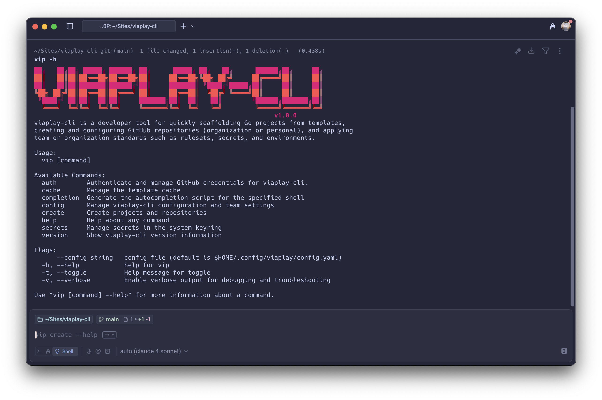

# viaplay-cli

**viaplay-cli** is a developer tool for quickly scaffolding projects, creating and configuring GitHub repositories, and applying team or organization standards such as rulesets, secrets, and environments.

<p align="center">
  
</p>

## 📦 Installation

### Homebrew (macOS & Linux)

```bash
# Set your GitHub token for accessing private repositories
export HOMEBREW_GITHUB_API_TOKEN=your_github_token

# Tap the repository and install
brew tap nentgroup/viaplay-cli-2 https://github.com/nentgroup/viaplay-cli-2
brew install --cask vip
```

> **Note:** The `HOMEBREW_GITHUB_API_TOKEN` is required to access private repositories. You can generate a token with the `repo` scope at [GitHub Settings > Developer Settings > Personal Access Tokens](https://github.com/settings/tokens).

### Manual Installation

#### Download Binaries

You can download pre-built binaries from the [releases page](https://github.com/nentgroup/viaplay-cli/releases).

##### macOS Security Bypass

When installing on macOS by downloading the binary directly, you may encounter security blocks. To bypass these:

```bash
# After downloading the binary
chmod +x ./vip

# Remove the quarantine attribute
xattr -dr com.apple.quarantine ./vip

# Now you can move it to your PATH
sudo mv vip /usr/local/bin/
```

#### Build from Source

```bash
# Clone the repository
git clone https://github.com/nentgroup/viaplay-cli.git
cd viaplay-cli

# Build the binary
go build -o vip ./cmd/vip

# Optionally, move to a directory in your PATH
sudo mv vip /usr/local/bin/
```

## ⚡ What is viaplay-cli?

viaplay-cli is a CLI tool for developers to:
- Scaffold new projects from templates (Go, TypeScript, etc.)
- Create and configure GitHub repositories (personal or organization)
- Apply team/organization settings (rulesets, secrets, environments)
- Manage secrets securely using your system keyring

## 🚀 Quick Start

### Authentication

First, authenticate with GitHub:

```bash
vip auth login
```

This will open your browser to authenticate with GitHub and store your token securely in your system keyring.

### Create a New Project

```bash
# Create a new Go API service
vip create project --name my-service --language go --type api --team platform

# Create a TypeScript library
vip create project --name my-lib --language typescript --type library --team frontend
```

### Create a Repository Only

```bash
vip create repo --name my-repo --team platform --description "My awesome repository"
```

### Check Your Authentication Status

```bash
vip auth status
```

## 🛠️ Development

### Prerequisites
- Go 1.21 or later
- [Task](https://taskfile.dev/) (optional, for easier scripts)

### Build the CLI

```bash
go build -o vip ./cmd/vip
```

### Run the CLI (development)

```bash
go run ./cmd/vip --help
```

### Lint & Format

```bash
golangci-lint run --fix
```

### Run Tests

```bash
go test ./...
```

## 📚 Documentation

**Full documentation is available at: [https://nentgroup.github.io/viaplay-cli-2](https://nentgroup.github.io/viaplay-cli-2)**

The documentation includes:

- [Getting Started Guide](https://nentgroup.github.io/viaplay-cli-2/#/getting-started/quickstart)
- [Installation Instructions](https://nentgroup.github.io/viaplay-cli-2/#/getting-started/installation)
- [Full CLI Usage & Commands](https://nentgroup.github.io/viaplay-cli-2/#/cli/index)
- [Project Creation Guide](https://nentgroup.github.io/viaplay-cli-2/#/project-creation)
- [Configuration Reference](https://nentgroup.github.io/viaplay-cli-2/#/configuration)
- [Templates & Teams](https://nentgroup.github.io/viaplay-cli-2/#/teams-and-templates)
- [Environments & Rulesets](https://nentgroup.github.io/viaplay-cli-2/#/envs)
- [Secrets Management](https://nentgroup.github.io/viaplay-cli-2/#/secrets)

## 🧩 Features

- **Project Templates**: Create new projects with best practices pre-configured
- **GitHub Integration**: Create and configure repositories directly from the CLI
- **Team Configurations**: Apply standardized environments, rulesets, and secrets
- **Secure Authentication**: GitHub tokens stored securely in your system keyring
- **Extensible Architecture**: Easy to add new templates and project types

## 📄 License

This project is licensed under the [MIT License](LICENSE).
